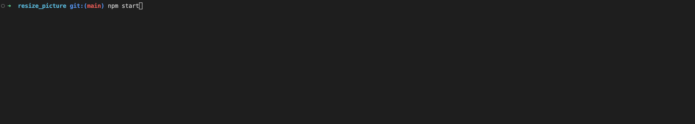
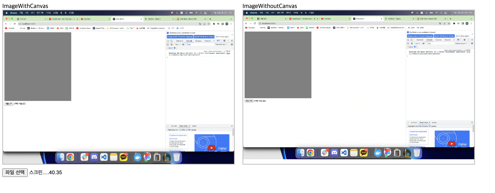
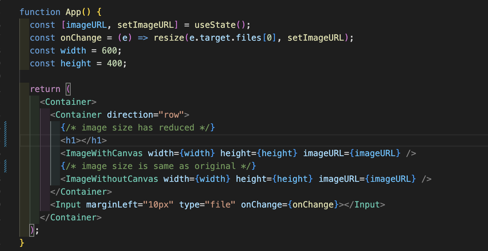

# How To Start?

typing npm start on terminal

# How to use

upload image files and check the differences between
ImageWithCanvas and ImageWithoutCanvas

and you can change size of image by changing width and height
