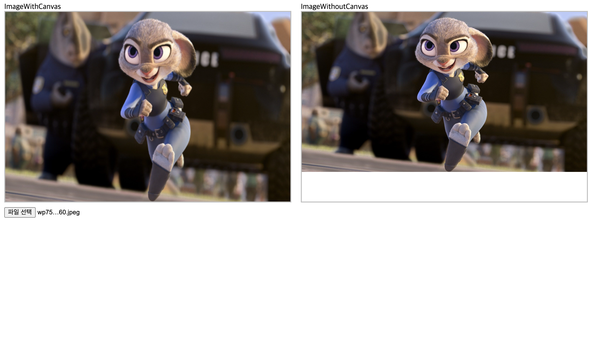

# How To Start?

typing npm start on terminal

# Upload Your Image!

upload image files and check the differences between
ImageWithCanvas and ImageWithoutCanvas

# you can handle your image's Size!

you can change size of image by changing width and height
